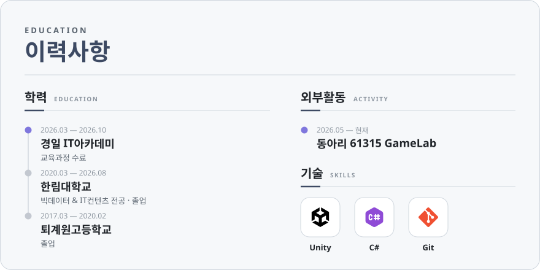
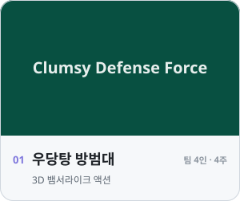
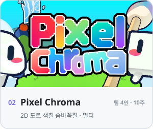
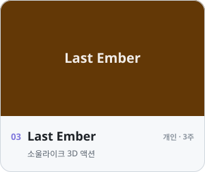
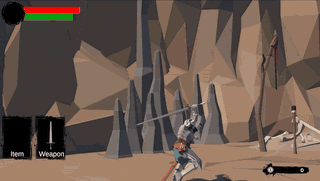

<!-- Header -->

  

  

<!-- TODO: Web 주소 입력 / 포트폴리오 PDF는 assets/Portfolio.pdf 로 올리면 클릭 시 바로 다운로드됨 -->

  
  
  

 

<!-- 이력사항 패널 (assets/education-*.svg, gen-svg.sh 로 생성) -->

  <picture>
    <source media="(prefers-color-scheme: dark)" srcset="./assets/education-dark.svg" />
    
  </picture>

 

<picture>
  <source media="(prefers-color-scheme: dark)" srcset="./assets/projects-dark.svg" />
  
</picture>

<!-- 프로젝트 카드 (assets/card-*.svg, gen-svg.sh 로 생성)
     정지 이미지: assets/projects/<key>.png 를 넣고 gen-svg.sh 재실행 (key: clumsy, pixelchroma, lastember)
     플레이 GIF: 아래 placehold.co 주소를 ./assets/projects/<key>.gif 로 교체 -->

  <a href="https://github.com/chlwnsdud2025/Clumsy-Defense-Force"><picture><source media="(prefers-color-scheme: dark)" srcset="./assets/card-clumsy-dark.svg" /></picture></a>
  <a href="https://github.com/chlwnsdud2025/Pixel-Chroma"><picture><source media="(prefers-color-scheme: dark)" srcset="./assets/card-pixelchroma-dark.svg" /></picture></a>
  <a href="https://github.com/chlwnsdud2025/Last-Ember"><picture><source media="(prefers-color-scheme: dark)" srcset="./assets/card-lastember-dark.svg" /></picture></a>

  
<b>플레이 영상 보기</b>

   
  

    
    
    
  

 

<picture>
  <source media="(prefers-color-scheme: dark)" srcset="./assets/journey-dark.svg" />
  
</picture>

| 시기 | 프로젝트 | 한 줄 소개 |
|:---:|:---|:---|
| `2025.03` | [Capstone Project](https://github.com/chlwnsdud2025/Capstone-project) | 대학 캡스톤 팀 프로젝트 · Unity 2022.3 |
| `2026.04` | [Last Ember](https://github.com/chlwnsdud2025/Last-Ember) | 첫 개인 3D 게임 |
| `2026.05` | [우당탕 방범대](https://github.com/chlwnsdud2025/Clumsy-Defense-Force) | 첫 팀 협업 · 3D 뱀서라이크 |
| `2026.06` | [Winter Stove](https://github.com/chlwnsdud2025/Winter-Stove) | VR 도전 · Meta Quest |
| `2026.07` | [Pixel Chroma](https://github.com/chlwnsdud2025/Pixel-Chroma) | 네트워크 멀티플레이 · Steam |
| `2026.10` | [BabyThieves](https://github.com/chlwnsdud2025/BabyThieves_Project) |  |

<!-- TODO: 레포를 Public으로 바꾼 뒤 주석 해제 (지금은 비공개 기여가 집계되지 않아 숫자가 작게 나옴)
 

  

-->

<!-- Footer -->

  

